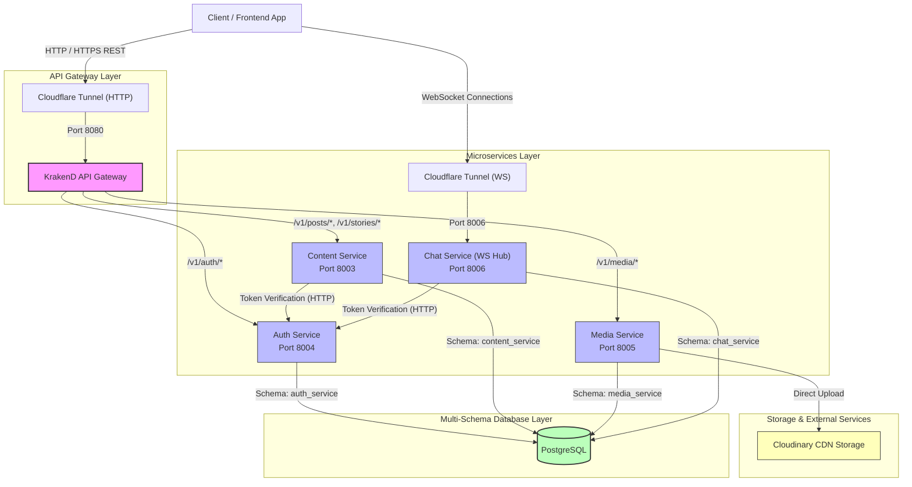
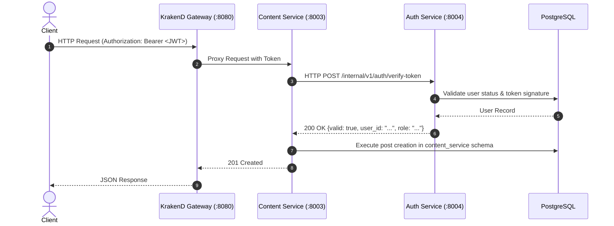
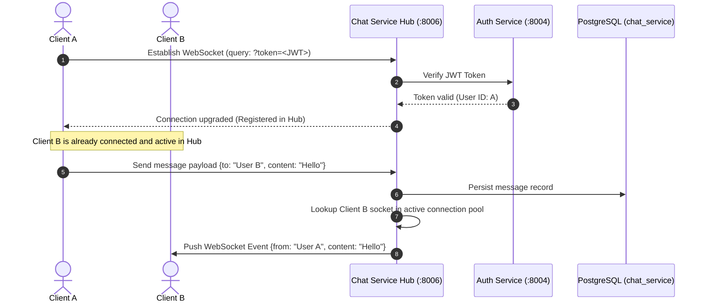

<div align="center">

# ✍️ Writeful Backend Microservices (`writeful`)

**The high-performance, event-driven Microservices platform for blogging and real-time messaging.**

[](https://golang.org)
[](https://www.krakend.io/)
[](https://developer.mozilla.org/en-US/docs/Web/API/WebSockets_API)
[](https://www.postgresql.org)
[](https://cloudinary.com)
[](https://developers.cloudflare.com/cloudflare-one/connections/connect-networks/)
[](https://www.docker.com)

</div>

---

**Writeful** is a modular, decoupled microservices platform designed for modern blogging, content authoring, and real-time private messaging. 

The system leverages **KrakenD** as a high-throughput API Gateway, isolated **Cloudflare Tunnels** for secure zero-trust network ingress (HTTP and WebSockets), independent **Go backend services**, a multi-schema **PostgreSQL** database, and **Cloudinary** for media transformations.

---

## System Architecture



---

## Microservices Breakdown

| Service | Port | Gateway Route Prefix | Database Schema | Primary Responsibilities |
|---|---|---|---|---|
| **`gateway-service`** | `8080` | `/v1/*` | - | Central routing, CORS handling, rate limiting, request proxying |
| **`auth-service`** | `8004` | `/v1/auth/*` | `auth_service` | User registration, login, JWT token issuance, token verification |
| **`content-service`** | `8003` | `/v1/posts/*`, `/v1/stories/*` | `content_service` | Blog posts, draft stories, tagging, category feeds, background music |
| **`media-service`** | `8005` | `/v1/media/*` | `media_service` | Media file uploads, Cloudinary CDN integrations, image metadata |
| **`chat-service`** | `8006` | WebSocket Direct | `chat_service` | Real-time WebSocket message hub, private messaging, chat history |

---

## Core Interaction Flows

### 1. Synchronous Token Verification Flow
When a client requests a protected endpoint in a downstream microservice (e.g. creating a post in `content-service`), the downstream service verifies the JWT directly against `auth-service`:



### 2. Real-Time WebSocket Chat Flow
WebSocket connections bypass KrakenD and route through a dedicated Cloudflare Tunnel directly into `chat-service`'s in-memory connection hub:



---

## Repository Structure

```
.
├── auth-service/                # Authentication & User Management (Go)
│   ├── cmd/serverd/
│   ├── internal/
│   └── .env.example
├── content-service/             # Articles, Stories, Tags & Music (Go)
│   ├── cmd/serverd/
│   ├── internal/
│   └── .env.example
├── media-service/               # Cloudinary Uploads & Media Assets (Go)
│   ├── cmd/serverd/
│   ├── internal/
│   └── .env.example
├── chat-service/                # Real-Time WebSocket Chat Engine (Go)
│   ├── cmd/serverd/
│   ├── internal/
│   └── .env.example
├── gateway-service/             # KrakenD API Gateway configuration & Dockerfile
│   └── krakend.json
├── docker-compose.yml           # Multi-container orchestration specification
└── Makefile                     # Unified management and operations interface
```

---

## Getting Started

### Prerequisites

- **Docker & Docker Compose** (v2+)
- **Go**: `1.22+` (for local standalone development)
- **PostgreSQL**: PostgreSQL 14+ running on port `5438` (or configured host)

### 1. Configure Environment Files

Create `.env` files for each microservice from their corresponding `.env.example`:

```bash
cp auth-service/.env.example auth-service/.env
cp content-service/.env.example content-service/.env
cp media-service/.env.example media-service/.env
cp chat-service/.env.example chat-service/.env
```

### 2. Start All Microservices

Run the complete microservices ecosystem in background mode:

```bash
make up
```

Verify services status:

```bash
make ps
```

Once running, the API Gateway is available at:
- **API Gateway**: `http://localhost:8080`
- **Health Endpoint**: `http://localhost:8080/health`

---

## Makefile Reference

| Command | Description |
|---|---|
| `make up` | Start all microservices in detached mode |
| `make down` | Stop all microservices containers |
| `make restart` | Restart all running microservices |
| `make restart-gateway` | Recreate and restart `gateway-service` |
| `make restart-auth` | Recreate and restart `auth-service` |
| `make restart-content` | Recreate and restart `content-service` |
| `make restart-media` | Recreate and restart `media-service` |
| `make restart-chat` | Recreate and restart `chat-service` |
| `make logs` | Stream live logs for all microservices |
| `make logs-gateway` | Stream logs for `gateway-service` |
| `make logs-auth` | Stream logs for `auth-service` |
| `make logs-content` | Stream logs for `content-service` |
| `make logs-media` | Stream logs for `media-service` |
| `make logs-chat` | Stream logs for `chat-service` |
| `make health` | Check health status of the KrakenD Gateway |
| `make rebuild` | Pull latest images and force-recreate all containers |
| `make clean` | Stop and remove all containers and networks |

---

## License

This project is licensed under the [MIT License](LICENSE).
