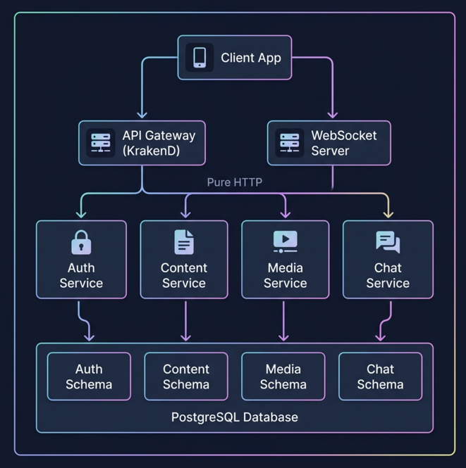
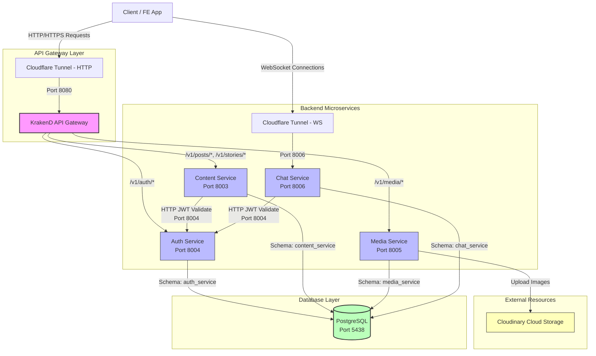
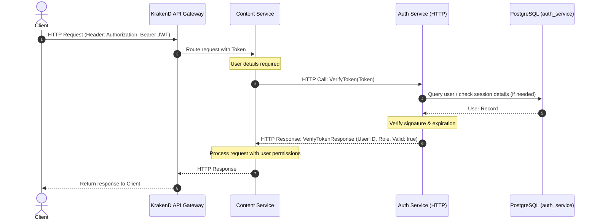
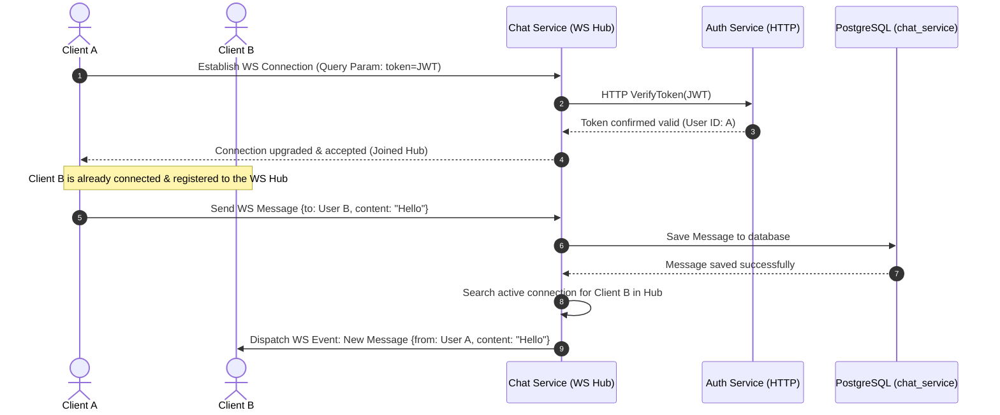

<div align="center">

# ✍️ Writeful Backend Microservices (`writeful`)

**The high-performance, event-driven Microservices platform for blogging and real-time messaging.**

[](https://golang.org)
[](https://www.krakend.io/)
[](https://developer.mozilla.org/en-US/docs/Web/API/WebSockets_API)
[](https://www.postgresql.org)
[](https://cloudinary.com)
[](https://developers.cloudflare.com/cloudflare-one/connections/connect-networks/)
[](https://www.docker.com)

</div>

---

This document provides an overview of the backend microservices architecture for the **Writeful** project, detailing the services, flow diagrams, environment configuration, and operation instructions.

---

## 📌 System Overview

The **Writeful** backend is built on an API-driven **Microservices** architecture designed for independence, security, and scalability. 

The system consists of the following key components:
1. **API Gateway (KrakenD)**: Centralized entry point that routes HTTP requests from clients to their corresponding downstream microservices.
2. **Cloudflare Tunnels**: Secure tunnels that expose the API Gateway (HTTP) and the Chat Service (WebSocket) to the internet without opening public ports on the host.
3. **Auth Service (Go - REST)**: Manages users, sign-ups, sign-ins, and issues/validates JWT tokens.
4. **Content Service (Go - REST)**: Manages articles (posts), draft stories, search tags, and attached music.
5. **Media Service (Go - REST)**: Uploads and manages media files (images/videos) using the Cloudinary cloud storage service.
6. **Chat Service (Go - WebSockets/REST)**: Enables real-time private messaging between users over WebSocket connections.

---

## 🏗️ System Architecture



Below is the general system data flow for the Writeful backend:



---

## 🔄 Core Flows (Flow Diagrams)

### 1. User Authentication & Token Verification (HTTP)
When a client requests a protected endpoint (e.g. creating a post in the `Content Service`), the target service makes a synchronous HTTP call to the `Auth Service` to verify the user token:



### 2. Real-Time WebSocket Chat Flow
Since API Gateway (KrakenD) does not natively support robust, persistent WebSocket proxying, the real-time chat traffic is isolated through a dedicated Cloudflare Tunnel pointing directly to the `Chat Service`:



---

## 🛠️ Microservice Directory Details

### 1. Gateway Service
* **Technology**: KrakenD API Gateway.
* **Responsibilities**: Central entry routing, rate limiting, request/response transformation, and endpoint aggregation.
* **Configurations**: Located in [gateway-service](file:///Users/haopham/go-playground/writeful/gateway-service).

### 2. Auth Service
* **Technology**: Go (Gin Web Framework, SQLBoiler/gorm).
* **Responsibilities**: User signup/signin, authorization, session management, and exposing token verification APIs.
* **Environment Configuration**: Setup details in [auth-service/.env.example](file:///Users/haopham/go-playground/writeful/auth-service/.env.example).

### 3. Content Service
* **Technology**: Go (Gin Web Framework, HTTP Client).
* **Responsibilities**: Core posting engine, draft/publish workflows for stories, tags indexing, and background music associations.
* **Environment Configuration**: Setup details in [content-service/.env.example](file:///Users/haopham/go-playground/writeful/content-service/.env.example).

### 4. Media Service
* **Technology**: Go (Gin Web Framework).
* **Responsibilities**: Uploads file streams to Cloudinary, stores references in database, and returns static asset URLs.
* **Environment Configuration**: Setup details in [media-service/.env.example](file:///Users/haopham/go-playground/writeful/media-service/.env.example).

### 5. Chat Service
* **Technology**: Go (Gorilla Websocket, HTTP Client).
* **Responsibilities**: Handles raw WebSocket connections, maintains connection hub state, publishes messages, and tracks unread message statistics.
* **Environment Configuration**: Setup details in [chat-service/.env.example](file:///Users/haopham/go-playground/writeful/chat-service/.env.example).

---

## ⚙️ Environment Configuration

For each backend microservice, copy the `.env.example` file to `.env` and fill in the target variables:

```bash
# Execute within the corresponding microservice directories
cp auth-service/.env.example auth-service/.env
cp content-service/.env.example content-service/.env
cp media-service/.env.example media-service/.env
cp chat-service/.env.example chat-service/.env
```

### Key Configurations:
* **`PORT`**: The HTTP port for the service (Defaults: Auth - `8004`, Content - `8003`, Media - `8005`, Chat - `8006`).
* **`DB.URL`**: PostgreSQL connection string. Format: `postgres://<username>:<password>@<host>:<port>/<db_name>?sslmode=disable&search_path=<schema>`.
* **`JWT.SECRET`**: Signature secret key for JWT tokens. Replace with a secure key in production.
* **`CLOUDINARY`**: Credentials (Cloud Name, API Key, API Secret) for the Cloudinary integration in `media-service`.
* **`AUTH_SERVICE_GRPC_ADDR`**: The host:port for gRPC connections (Optional / Used for testing only).

---

## 🚀 Operation & Running Guide

A root-level `Makefile` is provided to simplify orchestration, container builds, and database utilities.

### Key Make Targets:

* **Start the ecosystem** (in background mode):
  ```bash
  make up
  ```
* **Stop all running containers**:
  ```bash
  make down
  ```
* **Stream container logs**:
  ```bash
  make logs             # Logs for all services
  make logs-auth        # Auth Service logs only
  make logs-content     # Content Service logs only
  make logs-chat        # Chat Service logs only
  ```
* **Rebuild all local Docker images**:
  ```bash
  make build-all
  ```
